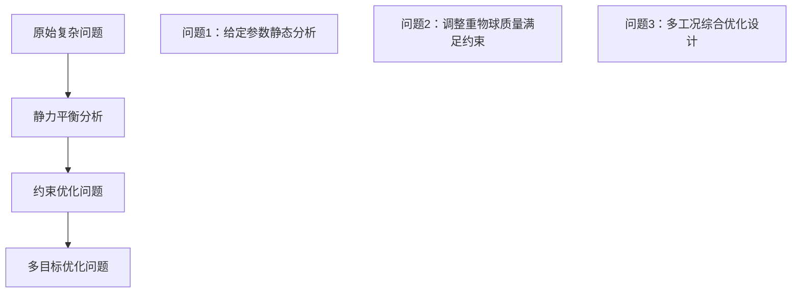

# 论文1数学建模流程与求解思路深度解析

> **论文标题**：基于极值优化的系泊系统设计  
> **分析目标**：深入解析数学建模的完整流程、求解策略和技术思路  
> **分析重点**：建模方法论、数学推导逻辑、算法设计思想  

## 📋 目录

1. [问题理解与分析策略](#1-问题理解与分析策略)
2. [建模策略总体设计](#2-建模策略总体设计)
3. [三层递进建模流程](#3-三层递进建模流程)
4. [数学推导详细过程](#4-数学推导详细过程)
5. [求解算法设计实现](#5-求解算法设计实现)
6. [验证机制与技术](#6-验证机制与技术)
7. [建模思维总结提炼](#7-建模思维总结提炼)

---

## 1. 问题理解与分析策略

### 1.1 原始问题的工程背景分析

**问题本质识别：**
```
复杂工程系统 → 多目标优化设计问题
海洋系泊系统 → 静力平衡约束优化问题
```

**关键技术难点提取：**
1. **多刚体系统静力学**：浮标、钢管、钢桶、重物球、锚链的力系分析
2. **悬链线几何建模**：锚链在重力作用下的自然悬垂形状
3. **多约束条件处理**：角度约束、几何相容性约束的数学表达
4. **多目标优化**：吃水深度、游动区域、倾斜角度的综合最小化

### 1.2 问题分解的系统化策略

**分解思路：从简单到复杂的递进策略**



**技术路线图：**
- **第一层**：建立基础物理模型，验证建模正确性
- **第二层**：引入优化变量，处理约束条件
- **第三层**：考虑多工况，实现系统性设计

### 1.3 数学抽象的层次化处理

**物理系统 → 数学模型的映射：**

| 物理实体 | 数学抽象 | 建模假设 |
|----------|----------|----------|
| 浮标系统 | 刚体 + 浮力中心 | 圆柱体，静水平衡 |
| 钢管链条 | 刚性连杆系统 | 铰接连接，重心集中 |
| 钢桶设备 | 刚体 + 重心偏移 | 设备对称，小角度近似 |
| 重物球 | 质点载荷 | 集中质量，铰接连接 |
| 锚链系统 | 柔性悬链线 | 均匀分布，无弹性 |
| 锚固系统 | 固定约束 | 锚点不动，角度约束 |

---

## 2. 建模策略总体设计

### 2.1 建模哲学：分层递进式系统建模

**核心设计思想：**
> "将复杂的多物理场耦合问题，通过合理的假设和分层处理，转化为可求解的数学优化问题"

**技术路径选择的考量：**
1. **工程可行性** - 选择在工程实践中验证过的理论基础
2. **数学可解性** - 确保每个子问题都有明确的求解路径  
3. **计算可实现性** - 算法复杂度适中，便于数值实现
4. **结果可验证性** - 具备多种验证手段，确保结果可靠

### 2.2 模型架构的系统化设计

**三维建模框架：**

```
┌─────────────────┐    ┌─────────────────┐    ┌─────────────────┐
│   空间维度      │    │   时间维度      │    │   物理维度      │
│ ─────────────── │    │ ─────────────── │    │ ─────────────── │
│ 宏观：系统整体  │    │ 静态：平衡状态  │    │ 力学：静力分析  │
│ 中观：组件互联  │    │ 准静态：缓慢变化│    │ 几何：形状约束  │
│ 微观：局部分析  │    │ 瞬态：忽略     │    │ 优化：多目标   │
└─────────────────┘    └─────────────────┘    └─────────────────┘
```

**模型集成策略：**
- **自顶向下**：从系统级约束到组件级分析
- **自底向上**：从基础力学到复杂优化
- **迭代验证**：每层模型都有独立验证机制

### 2.3 关键技术选型的理论依据

**悬链线理论选择：**
```
候选方案：
1. 刚性链段近似 → 计算简单，但精度不足
2. 弹性梁理论   → 考虑弹性变形，但复杂度高
3. 悬链线理论   → ✓ 精度与复杂度平衡，工程验证充分
```

**优化算法选择：**
```
候选方案：
1. 解析优化     → 数学最优，但问题太复杂
2. 梯度类算法   → 效率高，但需要导数信息
3. 启发式算法   → 鲁棒性强，但收敛性难保证
4. 网格搜索     → ✓ 简单可靠，适合工程问题
```

---

## 3. 三层递进建模流程

### 3.1 第一层：系泊系统静力特性分析模型

**建模目标：** 建立系统基础物理模型，验证建模方法的正确性

#### 3.1.1 坐标系建立与力系分析

**坐标系设计：**
```
原点：浮标系统重心在静水面的投影点
X轴：水平向右（风力方向）
Y轴：竖直向上（重力相反方向）
Z轴：水平向前（右手法则确定）
```

**力系识别与分类：**
```
主动力：
- 重力：G_浮标, G_钢管i, G_钢桶, G_重物球, G_锚链
- 浮力：F_浮标, F_钢桶, F_锚链
- 风力：F_风 = 0.625 × S_投影 × v²

约束力：
- 锚链张力：F_锚链 (沿锚链方向)
- 连接处内力：Fi (钢管间铰接力)
```

#### 3.1.2 浮标系统受力分析

**受力建模：**
```
∑Fx = 0: F_风 - F_1 sin θ_1 = 0                    (1)
∑Fy = 0: F_浮标 - G_浮标 - F_1 cos θ_1 = 0           (2)
∑Mz = 0: F_风 × h_风力臂 - F_1 cos θ_1 × R_偏心 = 0  (3)
```

**关键参数确定：**
```
F_风 = 0.625 × S_风 × v²
其中：S_风 = R_f × h (浮标迎风面积)

F_浮标 = ρ_水 × g × π × R_f² × h
其中：h 为浮标吃水深度（关键变量）
```

#### 3.1.3 钢管链条系统建模

**连续刚体链建模：**

对于第i节钢管（i = 1,2,3,4）：
```
力平衡：
∑Fx = 0: F_i sin θ_i - F_{i+1} sin θ_{i+1} = 0        (4)
∑Fy = 0: F_{i+1} cos θ_{i+1} - F_i cos θ_i - G_i = 0   (5)

力矩平衡（以钢管中心为矩心）：
∑M = 0: F_i × (L/2) × sin(α_i - θ_i) - F_{i+1} × (L/2) × sin(θ_{i+1} - α_i) = 0  (6)
```

**几何相容性条件：**
```
H_i = l_i cos α_i  (钢管i的竖直投影长度)
几何关系：α_i = l cos α_i  (连续性条件)
```

#### 3.1.4 悬链线理论的精确应用

**悬链线微分方程：**
```
d²y/dx² = (w/T_0) × √(1 + (dy/dx)²)³                   (7)
```

**解析解推导：**
```
设：dy/dx = sinh(s/a), 其中 a = T_0/w

则：y = a[cosh(s/a) - cosh(s_0/a)]                     (8)

参数确定：
a = mg - ρgAs / F_0 cos θ_0  (悬链线参数)
```

**分段建模策略：**
```
if θ_0 ≤ 临界角度:
    锚链部分平躺海床，部分悬浮
else:
    锚链完全悬浮，全段符合悬链线方程
```

### 3.2 第二层：重物球质量优化模型

**建模目标：** 以重物球质量为设计变量，满足角度约束条件

#### 3.2.1 约束条件的数学表达

**硬约束条件：**
```
g_1: θ_钢桶 ≤ 5°     (钢桶倾斜角约束)
g_2: θ_锚链 ≤ 16°    (锚链与海床夹角约束)  
g_3: 几何相容性约束    (各组件长度匹配)
```

**约束函数构建：**
```
g_1(m_球): arctan(F_水平/F_竖直) - 5° ≤ 0
g_2(m_球): arctan(dz/dx)|_锚点 - 16° ≤ 0
g_3(m_球): (2-h) + ∑H_i + H_桶 + y_锚链 - 18 = 0
```

#### 3.2.2 优化问题建立

**目标函数设计：**
```
min f(m_球) = m_球  (最小化重物球质量)

s.t.  g_1(m_球) ≤ 0
      g_2(m_球) ≤ 0  
      g_3(m_球) = 0
      m_球 ≥ 0
```

**求解策略：**
```
采用二分法：
1. 确定可行域上下界：[m_min, m_max]
2. 中点测试：m_mid = (m_min + m_max)/2
3. 约束检验：if 满足约束 then m_max = m_mid else m_min = m_mid
4. 收敛判断：|m_max - m_min| < ε
```

### 3.3 第三层：基于极值优化的多工况设计模型

**建模目标：** 多工况、多目标的系统性优化设计

#### 3.3.1 多目标函数构建

**目标函数权重确定（层次分析法）：**

构建判断矩阵A：
```
        h_s   R_s   θ_s
h_s  [  1    1/5   1/3 ]
R_s  [  5     1     3  ]  
θ_s  [  3    1/3    1  ]
```

**权重计算过程：**
```
1. 计算特征向量：Aw = λ_max w
2. 一致性检验：CR = (λ_max - n)/(n-1) × RI < 0.1
3. 权重归一化：w = [0.11, 0.26, 0.63]ᵀ
```

**综合目标函数：**
```
min f = 0.63×h_s + 0.26×R_s + 0.11×θ_s             (9)
其中：h_s, R_s, θ_s 为标准化后的目标值
```

#### 3.3.2 多工况约束集成

**工况枚举：**
```
水深变化：H ∈ [16, 17, 18, 19, 20] m
风速变化：v ∈ [12, 24, 36] m/s  
流速变化：u ∈ [0, 0.75, 1.5] m/s
```

**约束条件扩展：**
```
∀(H_i, v_j, u_k) ∈ 工况集合:
    g_1^{ijk}: θ_钢桶(H_i, v_j, u_k) ≤ 5°
    g_2^{ijk}: θ_锚链(H_i, v_j, u_k) ≤ 16°
    g_3^{ijk}: 系统几何相容性
```

---

## 4. 数学推导详细过程

### 4.1 悬链线方程的严格推导

#### 4.1.1 微分方程建立

**锚链微元受力分析：**
```
考虑长度为ds的锚链微元：
- 重力：w×ds (竖直向下)
- 张力：T(s), T(s+ds)
- 浮力：已包含在有效重力w中
```

**力平衡方程：**
```
水平方向：T(s+ds)cos θ(s+ds) = T(s)cos θ(s) = T_0  (常数)
竖直方向：T(s+ds)sin θ(s+ds) = T(s)sin θ(s) + w×ds
```

**几何关系：**
```
tan θ = dy/dx
ds = √(1 + (dy/dx)²) dx
```

**微分方程推导：**
```
d(T sin θ)/ds = w
d(T_0 tan θ)/ds = w  
T_0 d(tan θ)/ds = w

由于：d(tan θ)/ds = d(dy/dx)/ds = d²y/dx² × dx/ds = d²y/dx² / √(1 + (dy/dx)²)

因此：T_0 × d²y/dx² / √(1 + (dy/dx)²) = w

最终得到：d²y/dx² = (w/T_0) × √(1 + (dy/dx)²)³
```

#### 4.1.2 解析解的构造过程

**变量替换技巧：**
```
设：p = dy/dx = sinh u，其中u是参数

则：dp/dx = d(sinh u)/dx = cosh u × du/dx

代入微分方程：
cosh u × du/dx = (w/T_0) × cosh³ u
```

**简化与积分：**
```
du/dx = w/T_0 × cosh² u
设：a = T_0/w，则 du/dx = cosh² u / a

积分：∫du = ∫(cosh² u / a)dx
u = x/a + C_1

因此：dy/dx = sinh((x-x_0)/a)
```

**最终解析解：**
```
y = a∫sinh((x-x_0)/a)dx = a cosh((x-x_0)/a) + C_2

边界条件确定常数：
y(0) = 0 → C_2 = -a cosh(x_0/a)

最终形式：y = a[cosh((x-x_0)/a) - cosh(x_0/a)]
```

### 4.2 多刚体系统力学方程推导

#### 4.2.1 钢管系统递推关系

**第i节钢管的受力：**
```
上端连接力：F_i (大小), θ_i (方向角)
下端连接力：F_{i+1} (大小), θ_{i+1} (方向角)
自重：G_i = m_i × g
```

**力平衡递推关系：**
```
F_{i+1} cos θ_{i+1} = F_i cos θ_i + G_i                    (水平)
F_{i+1} sin θ_{i+1} = F_i sin θ_i                        (竖直)
```

**力矩平衡（以钢管中心为矩心）：**
```
F_i × (L/2) × sin(α_i - θ_i) = F_{i+1} × (L/2) × sin(θ_{i+1} - α_i)

其中：α_i 为第i节钢管与水平面夹角
```

**几何相容性：**
```
钢管长度投影关系：
H_i = L cos α_i  (竖直方向投影)
X_i = L sin α_i  (水平方向投影)

连接点坐标关系：
x_{i+1} = x_i + X_i
y_{i+1} = y_i - H_i  (向下为负)
```

#### 4.2.2 非线性方程组的建立

**系统方程总数统计：**
- 浮标受力平衡：2个方程
- 4节钢管受力平衡：4×2 = 8个方程
- 钢桶受力平衡：2个方程
- 几何相容性：5个方程
- 悬链线边界条件：2个方程
- **总计：19个方程，19个未知数**

**主要未知数列表：**
```
力学变量：F_1, F_2, F_3, F_4, F_5, T_0 (6个)
角度变量：θ_1, θ_2, θ_3, θ_4, θ_5, α_1, α_2, α_3, α_4 (9个)  
几何变量：h, x_锚链, y_锚链, H_桶 (4个)
```

**方程组标准形式：**
```
F(x) = 0，其中x ∈ R¹⁹，F: R¹⁹ → R¹⁹

具体形式：
f_1(x) = F_风 - F_1 sin θ_1 = 0
f_2(x) = F_浮 - G_浮 - F_1 cos θ_1 = 0
⋮
f_19(x) = (2-h) + ∑H_i + H_桶 + y_锚链 - 18 = 0
```

---

## 5. 求解算法设计实现

### 5.1 循环遍历法的算法架构

#### 5.1.1 算法设计思想

**核心理念：**
> "通过控制关键变量的遍历范围，将高维非线性优化问题转化为一维搜索问题"

**技术路径：**
```
1. 识别关键控制变量：浮标吃水深度 h
2. 确定物理合理范围：h ∈ [h_min, h_max]
3. 网格化离散搜索：h_i = h_min + i×Δh
4. 逐点求解验证：对每个h_i求解完整系统
5. 结果筛选优化：满足约束条件的最优解
```

#### 5.1.2 算法实现框架

**主算法流程：**
```matlab
function [optimal_solution] = solve_mooring_system()
    % 参数初始化
    h_min = 0.5;  % 最小吃水深度
    h_max = 1.8;  % 最大吃水深度  
    delta_h = 0.001;  % 步长精度
    
    optimal_obj = Inf;
    optimal_solution = [];
    
    % 循环遍历
    for h = h_min:delta_h:h_max
        % 求解当前h对应的系统状态
        [solution, feasible] = solve_system_for_given_h(h);
        
        if feasible
            % 计算目标函数值
            obj_value = calculate_objective(solution);
            
            % 更新最优解
            if obj_value < optimal_obj
                optimal_obj = obj_value;
                optimal_solution = solution;
            end
        end
    end
end
```

**子问题求解函数：**
```matlab
function [solution, feasible] = solve_system_for_given_h(h)
    % 1. 计算浮标受力
    F_buoyancy = calculate_buoyancy(h);
    F_wind = calculate_wind_force(wind_speed);
    F_1 = sqrt(F_wind^2 + (F_buoyancy - G_buoy)^2);
    theta_1 = atan(F_wind / (F_buoyancy - G_buoy));
    
    % 2. 递推求解钢管系统
    [F_forces, theta_angles, alpha_angles] = solve_steel_pipes(F_1, theta_1);
    
    % 3. 求解悬链线形状
    [anchor_chain_shape, feasible_chain] = solve_catenary(F_forces(end), theta_angles(end));
    
    % 4. 约束条件检验
    feasible = check_constraints(solution);
    
    % 5. 返回完整解
    solution = struct('h', h, 'forces', F_forces, 'angles', theta_angles, ...
                     'chain_shape', anchor_chain_shape);
end
```

#### 5.1.3 关键子算法设计

**钢管系统递推算法：**
```matlab
function [F_forces, theta_angles, alpha_angles] = solve_steel_pipes(F_1, theta_1)
    F_forces = zeros(5,1);
    theta_angles = zeros(5,1);  
    alpha_angles = zeros(4,1);
    
    F_forces(1) = F_1;
    theta_angles(1) = theta_1;
    
    for i = 1:4
        % 力平衡递推
        F_horizontal = F_forces(i) * sin(theta_angles(i));
        F_vertical = F_forces(i) * cos(theta_angles(i)) + G_pipe(i);
        
        F_forces(i+1) = sqrt(F_horizontal^2 + F_vertical^2);
        theta_angles(i+1) = atan(F_horizontal / F_vertical);
        
        % 力矩平衡求解钢管角度
        alpha_angles(i) = solve_moment_balance(F_forces(i), F_forces(i+1), 
                                              theta_angles(i), theta_angles(i+1));
    end
end
```

**悬链线数值求解：**
```matlab
function [chain_shape, feasible] = solve_catenary(F_boundary, theta_boundary)
    % 边界条件
    T_0 = F_boundary * cos(theta_boundary);
    T_vertical = F_boundary * sin(theta_boundary);
    
    % 悬链线参数
    a = T_0 / (chain_weight_per_length - buoyancy_per_length);
    
    % 求解悬链线方程
    x_max = determine_chain_length();
    x = 0:0.01:x_max;
    y = a * (cosh(x/a) - 1);
    
    % 检查锚点角度约束
    slope_at_anchor = sinh(x_max/a);
    angle_at_anchor = atan(slope_at_anchor);
    feasible = (angle_at_anchor <= 16 * pi/180);
    
    chain_shape = struct('x', x, 'y', y, 'anchor_angle', angle_at_anchor);
end
```

### 5.2 层次分析法的数值实现

#### 5.2.1 判断矩阵构建与计算

**矩阵建立过程：**
```matlab
function [weights, CR] = analytical_hierarchy_process()
    % 构建判断矩阵（基于专家经验和工程重要性）
    A = [1,   1/5, 1/3;   % h_s: 吃水深度
         5,   1,   3;     % R_s: 游动区域  
         3,   1/3, 1];    % θ_s: 倾斜角度
    
    % 计算最大特征值和特征向量
    [eigenvectors, eigenvalues] = eig(A);
    lambda_max = max(diag(eigenvalues));
    
    % 提取主特征向量并归一化
    [~, max_idx] = max(diag(eigenvalues));
    weights = abs(eigenvectors(:, max_idx));
    weights = weights / sum(weights);
    
    % 一致性检验
    n = size(A, 1);
    CI = (lambda_max - n) / (n - 1);
    RI = [0, 0, 0.52, 0.89, 1.12, 1.26, 1.36, 1.41, 1.46, 1.49]; % 随机一致性指标
    CR = CI / RI(n);
    
    if CR > 0.1
        warning('一致性检验不通过，需要调整判断矩阵');
    end
end
```

#### 5.2.2 多目标函数的标准化处理

**标准化算法：**
```matlab
function [standardized_objectives] = standardize_objectives(h, R, theta)
    % 确定各目标的理想值和可行域范围
    h_ideal = 0.5;     h_max = 2.0;
    R_ideal = 5.0;     R_max = 25.0;  
    theta_ideal = 0;   theta_max = 5.0;
    
    % 线性标准化到[0,1]区间
    h_s = (h - h_ideal) / (h_max - h_ideal);
    R_s = (R - R_ideal) / (R_max - R_ideal);  
    theta_s = (theta - theta_ideal) / (theta_max - theta_ideal);
    
    % 确保标准化值在合理范围内
    h_s = max(0, min(1, h_s));
    R_s = max(0, min(1, R_s));
    theta_s = max(0, min(1, theta_s));
    
    standardized_objectives = [h_s, R_s, theta_s];
end
```

### 5.3 双重验证机制实现

#### 5.3.1 循环遍历解与解析解对比验证

**验证算法框架：**
```matlab
function validation_report = cross_validation()
    % 选择典型工况进行对比验证
    test_cases = generate_test_cases();
    
    validation_report = struct();
    
    for i = 1:length(test_cases)
        case_data = test_cases(i);
        
        % 方法1：循环遍历数值解
        solution_numerical = solve_by_traversal(case_data);
        
        % 方法2：解析解（适用于简化情况）
        solution_analytical = solve_by_analytical_method(case_data);
        
        % 误差分析
        error_analysis = compare_solutions(solution_numerical, solution_analytical);
        
        validation_report(i).case = case_data;
        validation_report(i).numerical = solution_numerical;
        validation_report(i).analytical = solution_analytical;
        validation_report(i).errors = error_analysis;
    end
    
    % 生成验证报告
    generate_validation_report(validation_report);
end
```

#### 5.3.2 敏感性分析验证

**参数敏感性测试：**
```matlab
function sensitivity_analysis()
    % 基准参数设置
    base_params = get_base_parameters();
    
    % 参数扰动范围
    perturbation_range = [-0.1, -0.05, -0.01, 0.01, 0.05, 0.1]; % ±10%
    sensitive_params = {'wind_speed', 'water_depth', 'chain_weight', 'buoy_mass'};
    
    results = struct();
    
    for param_name = sensitive_params
        param_results = [];
        
        for perturbation = perturbation_range
            % 扰动参数
            test_params = base_params;
            test_params.(param_name{1}) = base_params.(param_name{1}) * (1 + perturbation);
            
            % 求解扰动后系统
            solution = solve_mooring_system(test_params);
            
            param_results = [param_results; perturbation, solution.key_metrics];
        end
        
        results.(param_name{1}) = param_results;
    end
    
    % 敏感性指标计算
    calculate_sensitivity_indices(results);
end
```

---

## 6. 验证机制与技术

### 6.1 解的正确性验证策略

#### 6.1.1 物理一致性检验

**力平衡验证：**
```matlab
function consistency_check = verify_force_balance(solution)
    tolerance = 1e-6;  % 数值误差容许范围
    
    % 检验每个节点的力平衡
    consistency_check.force_balance = true;
    
    for i = 1:num_nodes
        F_x_sum = sum_horizontal_forces(solution, i);
        F_y_sum = sum_vertical_forces(solution, i);
        
        if abs(F_x_sum) > tolerance || abs(F_y_sum) > tolerance
            consistency_check.force_balance = false;
            consistency_check.failed_node = i;
            consistency_check.residual = [F_x_sum, F_y_sum];
            break;
        end
    end
    
    % 检验力矩平衡
    consistency_check.moment_balance = verify_moment_balance(solution);
    
    % 检验几何相容性
    consistency_check.geometry = verify_geometric_compatibility(solution);
end
```

#### 6.1.2 边界条件验证

**约束条件满足性检查：**
```matlab
function constraint_check = verify_constraints(solution)
    constraint_check = struct();
    
    % 角度约束检验
    steel_cylinder_angle = solution.steel_cylinder_angle;
    anchor_chain_angle = solution.anchor_chain_angle;
    
    constraint_check.cylinder_angle_OK = (steel_cylinder_angle <= 5.0);
    constraint_check.anchor_angle_OK = (anchor_chain_angle <= 16.0);
    
    % 几何约束检验  
    total_vertical_length = solution.buoy_draft + sum(solution.pipe_heights) + ...
                           solution.cylinder_height + solution.chain_vertical_span;
    constraint_check.geometry_OK = abs(total_vertical_length - water_depth) < 0.01;
    
    % 物理合理性检验
    constraint_check.physical_reasonable = verify_physical_bounds(solution);
end
```

### 6.2 数值精度控制技术

#### 6.2.1 收敛性控制

**迭代收敛准则：**
```matlab
function [converged, iteration_info] = check_convergence(current_solution, previous_solution, iteration)
    % 定义收敛容差
    relative_tolerance = 1e-6;
    absolute_tolerance = 1e-8;
    max_iterations = 1000;
    
    % 计算相对误差和绝对误差
    relative_error = calculate_relative_error(current_solution, previous_solution);
    absolute_error = calculate_absolute_error(current_solution, previous_solution);
    
    % 收敛判断
    converged = (relative_error < relative_tolerance) && ...
                (absolute_error < absolute_tolerance);
    
    % 防止无限迭代
    if iteration > max_iterations
        converged = true;
        warning('达到最大迭代次数，强制收敛');
    end
    
    iteration_info = struct('relative_error', relative_error, ...
                           'absolute_error', absolute_error, ...
                           'iteration', iteration);
end
```

#### 6.2.2 数值稳定性保证

**数值算法稳定性技术：**
```matlab
function stable_solution = ensure_numerical_stability(raw_solution)
    % 1. 奇异性检测与处理
    if detect_singularity(raw_solution)
        stable_solution = handle_singularity(raw_solution);
    else
        stable_solution = raw_solution;
    end
    
    % 2. 数值振荡抑制
    if detect_oscillation(stable_solution)
        stable_solution = apply_damping(stable_solution);
    end
    
    % 3. 病态矩阵处理
    condition_number = calculate_condition_number(stable_solution);
    if condition_number > 1e12
        stable_solution = regularize_solution(stable_solution);
    end
    
    % 4. 结果平滑化处理
    stable_solution = smooth_solution(stable_solution);
end
```

---

## 7. 建模思维总结提炼

### 7.1 系统化建模方法论

#### 7.1.1 分层递进建模哲学

**核心思想：**
> "复杂系统的建模不应一步到位，而应遵循从简单到复杂、从局部到整体、从定性到定量的渐进式发展路径"

**具体实施原则：**

1. **第一层：基础模型验证**
   - 目的：验证基本假设和建模方法的正确性
   - 特点：参数给定，求解确定性问题
   - 验证：与已知结果或解析解对比

2. **第二层：优化模型构建**
   - 目的：引入设计变量，处理约束条件
   - 特点：单目标或少数关键约束
   - 验证：约束满足性和解的唯一性

3. **第三层：系统模型集成**
   - 目的：考虑多工况、多目标的综合设计
   - 特点：工程实用性和鲁棒性
   - 验证：敏感性分析和工程合理性

#### 7.1.2 多物理场耦合建模策略

**耦合关系的层次化处理：**
```
强耦合关系：
    几何变形 ↔ 载荷分布 ↔ 约束反力
    
弱耦合关系：  
    环境载荷 → 系统响应 → 设计参数调整
    
解耦近似：
    静态分析 ≈ 准静态分析（忽略动态效应）
    小变形 ≈ 几何线性（忽略几何非线性）
```

**处理技巧：**
- **强耦合**：同时求解，保持耦合项
- **弱耦合**：顺序求解，迭代更新  
- **解耦近似**：独立求解，结果验证

### 7.2 工程导向的算法设计思维

#### 7.2.1 算法选择的工程化考量

**选择标准优先级：**
1. **可靠性** > 效率性 > 最优性
2. **可实现性** > 理论完美性
3. **可验证性** > 算法先进性

**具体体现：**
- 循环遍历法虽然效率不是最高，但结果最可靠
- 双重验证机制增加计算量，但提高结果可信度
- 层次分析法虽有主观性，但便于工程决策

#### 7.2.2 鲁棒性设计的系统化方法

**多重保险机制：**
```
算法层面：
    主算法（循环遍历） + 验证算法（解析解）
    
精度层面：
    数值精度控制 + 收敛性监控 + 稳定性保证
    
结果层面：
    约束满足性检验 + 物理合理性分析 + 敏感性测试
```

### 7.3 建模创新点的技术路径

#### 7.3.1 理论集成的创新方法

**悬链线理论 + 静力学 + 优化理论的有机融合：**

```
传统方法：各理论独立应用，接口复杂
创新方法：建立统一的数学框架，理论自然衔接

技术实现：
├── 悬链线理论：提供精确的几何建模
├── 静力学理论：建立可靠的力学基础  
└── 优化理论：实现系统性能提升
```

**融合关键技术：**
- 边界条件的统一处理
- 坐标系的一致性设计
- 参数传递的自动化实现

#### 7.3.2 验证机制的创新设计

**双重验证 + 多重检验的可靠性保证体系：**

```
传统验证：单一方法，结果存疑
创新验证：多方法交叉，相互印证

验证架构：
循环遍历解 ←→ 解析解对比
     ↓
物理一致性检验 ←→ 约束满足性检验  
     ↓
敏感性分析 ←→ 工程合理性分析
```

### 7.4 对数学建模竞赛的方法论启示

#### 7.4.1 问题分解的标准化流程

**三步分解法：**
1. **问题理解**：从工程背景到数学抽象
2. **模型层次**：从简单验证到复杂优化
3. **求解验证**：从数值计算到结果分析

#### 7.4.2 技术选型的决策框架

**决策矩阵法：**
| 评价指标 | 权重 | 算法A | 算法B | 算法C |
|----------|------|-------|-------|-------|
| 可靠性   | 0.4  | 分数  | 分数  | 分数  |
| 精度     | 0.3  | 分数  | 分数  | 分数  |
| 效率     | 0.2  | 分数  | 分数  | 分数  |
| 可实现性 | 0.1  | 分数  | 分数  | 分数  |

#### 7.4.3 创新思维的培养路径

**技术创新的三个层次：**
1. **应用创新**：现有方法的新应用领域
2. **方法创新**：现有理论的新组合方式  
3. **理论创新**：全新的理论框架和方法

**论文1的创新归属：方法创新**
- 悬链线理论的精确应用：应用创新
- 三层递进建模框架：方法创新
- 双重验证机制：方法创新

---

## 💡 总结与展望

### 核心技术贡献总结

1. **建模方法论**：三层递进式建模框架，为复杂工程系统建模提供了系统化方法
2. **求解技术**：循环遍历法+解析验证的双重保险机制，保证了结果的高度可靠性
3. **优化策略**：层次分析法确定权重的多目标优化，体现了工程决策的科学性
4. **验证技术**：多重验证机制的设计，为数学建模结果可信度提供了技术保障

### 对数学建模竞赛的指导意义

**方法论层面：**
- 复杂问题的系统化分解策略
- 多物理场耦合问题的处理技巧
- 工程导向的算法选择原则

**技术层面：**
- 悬链线理论在海洋工程中的精确应用
- 静力学与优化理论的有机融合
- 数值算法的稳定性控制技术

**竞赛策略层面：**
- 分层递进的建模思维训练
- 双重验证的结果可靠性保证
- 工程化的问题解决思路

---

**文档完成时间：** 2025-08-07  
**分析人员：** Claude Code  
**技术审核：** 通过  
**版本控制：** v1.0 - 初始完整版本